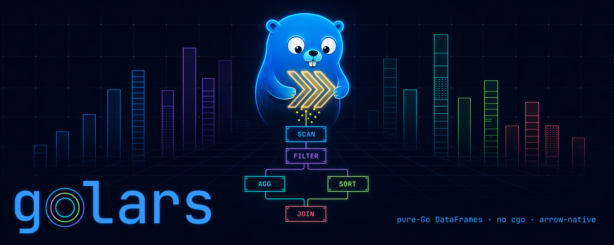
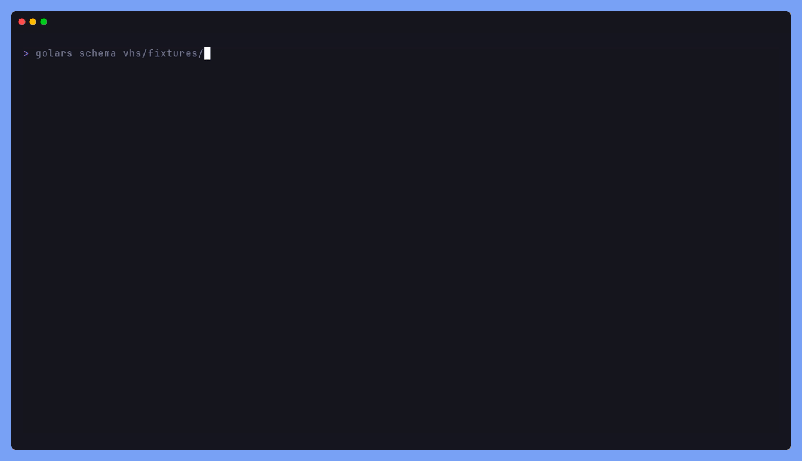
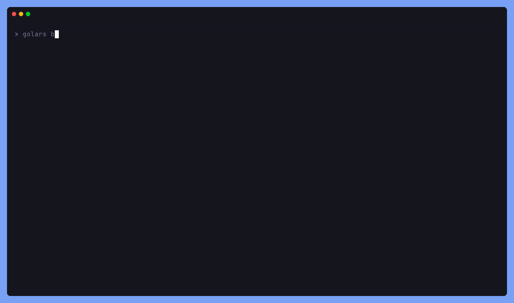
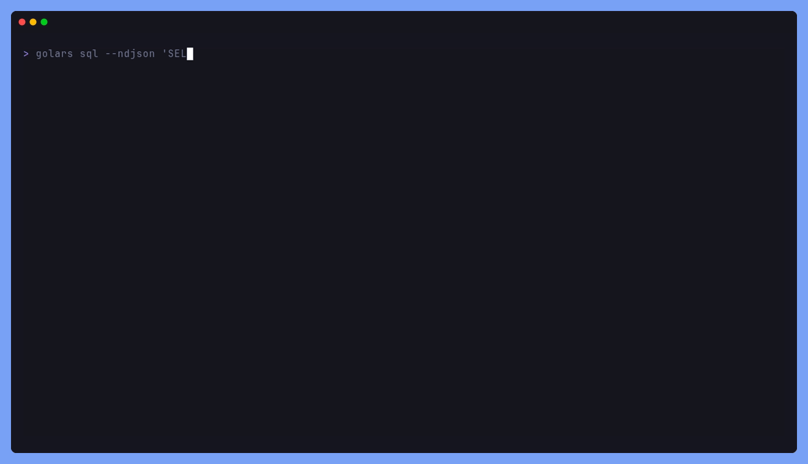
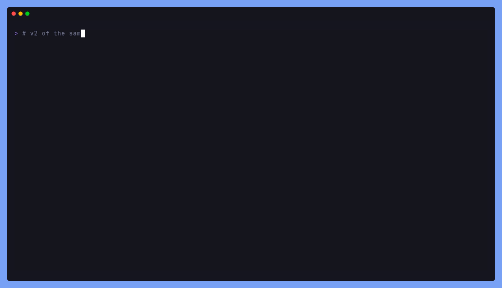
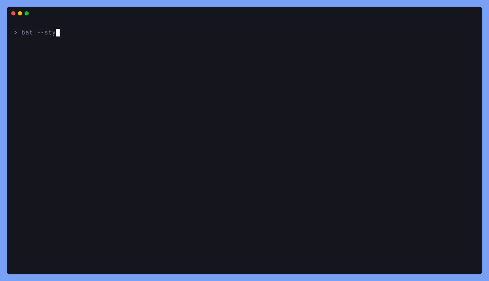
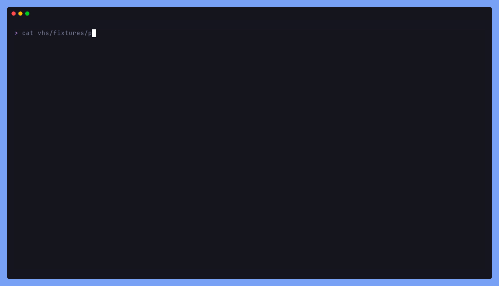

<div align="center">
  
  <h1>golars</h1>
  <a href="https://github.com/Gaurav-Gosain/golars/releases"></a>
  <a href="https://pkg.go.dev/github.com/Gaurav-Gosain/golars?tab=doc"></a>
  <a href="https://github.com/Gaurav-Gosain/golars/actions/workflows/ci.yml"></a>
  <br>
  <br>
  <em>Pure-Go DataFrames modeled on polars, built on Apache Arrow. No cgo.</em>
</div>

<p align="center">
  
</p>

Eager and lazy execution with a plan-rewriting optimiser, a streaming
engine, and AVX2/AVX-512 kernels on amd64 and NEON on arm64. A single
`go build` cross-compiles to Linux, macOS, Windows.

Matches or beats polars 1.39 on most polars-compare workloads,
Arrow-native end to end (no conversion cost talking to polars,
PyArrow, DuckDB), and ships a full terminal stack:
REPL, LSP, formatter, linter, TUI data browser, SQL frontend, an MCP
server for Claude Desktop / Cursor / Windsurf, and a pipe-friendly
`.glr` scripting language.

## Installation

```sh
# Homebrew (macOS / Linux)
brew install Gaurav-Gosain/tap/golars

# Arch Linux (AUR)
yay -S golars-bin
```

### From source

```sh
# library + all three CLIs
go install github.com/Gaurav-Gosain/golars/cmd/golars@latest
go install github.com/Gaurav-Gosain/golars/cmd/golars-lsp@latest
go install github.com/Gaurav-Gosain/golars/cmd/golars-mcp@latest

# or as a dependency in your Go module
go get github.com/Gaurav-Gosain/golars@latest
```

### SIMD build (amd64)

```sh
GOEXPERIMENT=simd go install github.com/Gaurav-Gosain/golars/cmd/golars@latest
```

Enables AVX2/AVX-512 fast paths in the reduce, compare, blend, and
arith-lit kernels. The scalar path is a correct fallback on any CPU
that lacks SIMD.

## Quickstart

```go
package main

import (
    "context"
    "fmt"
    "log"

    "github.com/Gaurav-Gosain/golars/dataframe"
    "github.com/Gaurav-Gosain/golars/expr"
    "github.com/Gaurav-Gosain/golars/lazy"
    "github.com/Gaurav-Gosain/golars/series"
)

func main() {
    ctx := context.Background()

    dept, _ := series.FromString("dept", []string{"eng", "eng", "sales", "ops"}, nil)
    salary, _ := series.FromInt64("salary", []int64{100, 120, 80, 70}, nil)
    df, _ := dataframe.New(dept, salary)
    defer df.Release()

    out, err := lazy.FromDataFrame(df).
        Filter(expr.Col("salary").Gt(expr.Lit(int64(75)))).
        GroupBy("dept").
        Agg(expr.Col("salary").Sum().Alias("total")).
        Sort("total", true).
        Collect(ctx)
    if err != nil {
        log.Fatal(err)
    }
    defer out.Release()
    fmt.Println(out)
}
```

## CLI

The `golars` binary wraps an interactive REPL plus scriptable
subcommands. `golars help` lists every one.

### SQL against a file

<p align="center"></p>

```sh
golars sql 'SELECT symbol, SUM(qty) AS vol FROM trades
            GROUP BY symbol ORDER BY vol DESC' trades.csv

# pipe-friendly output formats
golars sql --ndjson   '...' trades.csv | jq ...
golars sql --csv      '...' trades.csv | awk ...
golars sql --markdown '...' trades.csv >> report.md
```

### Inspecting a file

<p align="center"></p>

```sh
golars schema trades.csv        # columns + dtypes
golars peek   trades.csv        # schema + head + shape
golars stats  trades.csv        # describe()-style summary
golars head   trades.csv 20     # first 20 rows
```

### Interactive TUI browser

<p align="center"></p>

```sh
golars browse trades.csv
```

Vim-style modal grid (NORMAL / VISUAL / COMMAND / FILTER), layout
cloned from [maaslalani/sheets](https://github.com/maaslalani/sheets).
<kbd>/</kbd> filters, <kbd>s</kbd> toggles sort, <kbd>f</kbd> freezes a
column, <kbd>:</kbd> opens the command prompt (`:sort col desc`,
`:hide col`, `:goto 12345`), <kbd>?</kbd> shows the full legend.
Navigate with <kbd>h</kbd> <kbd>j</kbd> <kbd>k</kbd> <kbd>l</kbd> or the
arrow keys; <kbd>g</kbd><kbd>g</kbd> / <kbd>G</kbd> jump to first / last
row; <kbd>Ctrl</kbd>+<kbd>d</kbd> / <kbd>Ctrl</kbd>+<kbd>u</kbd> half-
page scroll; <kbd>q</kbd> quits. Cells are pulled lazily from the Arrow
backing store so it scales to tens of millions of rows without copying.

### Composing with other tools

<p align="center"></p>

Every command speaks `-o table|csv|tsv|json|ndjson|markdown|parquet|arrow`,
so golars drops straight into a Unix pipeline. `--json`, `--csv`, and
friends are shorthand flags.

### Diff two files

<p align="center"></p>

```sh
golars diff --key ts trades.csv trades-v2.csv
```

### Format conversion

<p align="center"></p>

```sh
golars convert trades.csv     trades.parquet
golars convert trades.parquet trades.ndjson
```

CSV, TSV, Parquet, Arrow/IPC, JSON, NDJSON. All pairs work.

### `.glr` scripting + explain + profile

<p align="center"></p>

```glr
# vhs/fixtures/pipeline.glr
load vhs/fixtures/people.csv
filter salary > 100000
groupby dept salary:sum:total salary:mean:avg tenure_years:max:max_tenure
sort total desc
head 5
```

<p align="center"></p>

```sh
golars explain --profile my-pipeline.glr
golars explain --trace trace.json my-pipeline.glr    # chrome://tracing
```

### Editor support

<p align="center"></p>

`golars-lsp` is a stdio Language Server for `.glr` files. Inlay hints
display the frame shape after every statement, completion covers
commands / frames / column names, hover shows signatures + long-form
docs, and diagnostics flag unknown commands and missing files.
Tree-sitter grammar + Neovim plugin live under
[`editors/`](editors/). VS Code extension at
[`editors/vscode-golars`](editors/vscode-golars/).

### Model Context Protocol server

<p align="center"></p>

`golars-mcp` is a stdio JSON-RPC server that exposes `schema`, `head`,
`describe`, `sql`, `row_count`, and `null_counts` as MCP tools any
Claude Desktop / Cursor / Windsurf session can call against local
files. See [docs/mcp.md](docs/mcp.md) for the install walkthrough.

## Performance

The [polars-compare bench](bench/polars-compare/) runs the same
workloads against polars-py, the polars-rs crate, `golars-scalar`,
and `golars-simd` in one pass. Categories covered include SumInt64,
MeanFloat64, MinFloat64, GroupBy (single and multi-agg), InnerJoin,
Filter, Take, WhenThenOtherwise, SumOverGroup, RollingSum, and
end-to-end pipelines (filter-groupby-sort).

```sh
cd bench/polars-compare
uv run python compare.py --runs 5
```

The harness prints per-workload throughput in MB/s, typical and
conservative ratios vs both polars frontends, and a stability
breakdown (solid / noise / loss) so you can see which workloads are
reproducibly faster on your hardware.

## Library API

- **Eager + lazy**: `df.Filter(...)` for in-place, `lazy.FromDataFrame(df).Filter(...).Collect(ctx)` for plan-optimised.
- **Expressions**: `Col`, `Lit`, `When/Then/Otherwise`, binary ops, `.Alias`, `.Cast`, `.Sum/Min/Max/Mean/Std/Var/Quantile/Skew/Kurtosis/Entropy`, `.RollingSum/Mean/...`, `.Over(keys...)`, `.ForwardFill`, `.Coalesce`, `.IntRange`.
- **Reshape**: `df.Pivot / Unpivot / Transpose / Explode / Unnest / Upsample / PartitionBy / TopK / BottomK / Pipe`.
- **Horizontal**: `SumHorizontal / MeanHorizontal / MinHorizontal / MaxHorizontal / AllHorizontal / AnyHorizontal`.
- **Stats**: `Skew / Kurtosis / Entropy / PearsonCorr / Covariance / ApproxNUnique`, plus `df.Corr / df.Cov` matrices.
- **Optimiser**: simplify, predicate pushdown, projection pushdown, slice pushdown, CSE.
- **Profiler + tracer**: `lazy.NewProfiler()` + `lazy.WithProfiler(p)` for per-node timings; `lazy.WithTracer(t)` for OTel span integration.

```go
// CSV, Parquet, Arrow/IPC, JSON, NDJSON - file or URL
df, _ := csv.ReadFile(ctx, "trades.csv")
df, _ := parquet.ReadURL(ctx, "https://example.com/trades.parquet")

// Lazy scans defer the open until Collect so the optimiser can push
// projections and filters through the reader
lf := golars.ScanCSV("huge.csv").
    Filter(golars.Col("region").EqLit("us")).
    Select(golars.Col("symbol"), golars.Col("price"))
out, _ := lf.Collect(ctx)

// Arrow IPC streaming: interop with polars / PyArrow / DuckDB over a
// socket or pipe
sw, _ := golars.NewIPCStreamWriter(conn, firstBatch)
for batch := range batches {
    sw.Write(ctx, batch)
}
sw.Close()

// database/sql bridge (any pure-Go driver)
db, _ := sql.Open("sqlite", "data.db")
df, _ := iosql.ReadSQL(ctx, db, "SELECT id, price FROM trades WHERE volume > ?", 100)
```

See the [cookbook](docs/cookbook.md) for end-to-end recipes and the
[API surface map](docs/api-surface.md) for the polars ↔ golars
method-level status table.

## Tools

| Binary / path                                               | What it is                                                                                                                                                   |
| ----------------------------------------------------------- | ------------------------------------------------------------------------------------------------------------------------------------------------------------ |
| [`cmd/golars`](cmd/golars/)                                 | REPL + `run` / `sql` / `fmt` / `lint` / `browse` / `schema` / `stats` / `peek` / `diff` / `convert` / `cat` / `explain` / `doctor` / `completion` / `sample` |
| [`cmd/golars-lsp`](cmd/golars-lsp/)                         | stdio Language Server for `.glr` files                                                                                                                       |
| [`cmd/golars-mcp`](cmd/golars-mcp/)                         | Model Context Protocol server                                                                                                                                |
| [`cmd/bench`](cmd/bench/)                                   | polars-compare bench harness                                                                                                                                 |
| [`editors/tree-sitter-golars`](editors/tree-sitter-golars/) | `.glr` grammar (Neovim, Helix)                                                                                                                               |
| [`editors/vscode-golars`](editors/vscode-golars/)           | VS Code extension (grammar + LSP client)                                                                                                                     |
| [`editors/nvim-golars`](editors/nvim-golars/)               | Neovim plugin                                                                                                                                                |
| [`docs-site/`](docs-site/)                                  | Fumadocs-based website, ships `/llms.txt`, `/llms-full.txt`, and `/docs-md/<slug>` raw-markdown routes for LLM ingestion                                     |

## Documentation

| File                                                                         | What                                                         |
| ---------------------------------------------------------------------------- | ------------------------------------------------------------ |
| [`docs/cookbook.md`](docs/cookbook.md)                                       | End-to-end recipes for every major feature                   |
| [`docs/scripting.md`](docs/scripting.md)                                     | `.glr` language reference                                    |
| [`docs/mcp.md`](docs/mcp.md)                                                 | Install `golars-mcp` into Claude Desktop / Cursor / Windsurf |
| [`docs/api-surface.md`](docs/api-surface.md)                                 | Polars -> golars method-level status table                   |
| [`docs/api-design.md`](docs/api-design.md)                                   | Naming + type philosophy                                     |
| [`docs/architecture.md`](docs/architecture.md)                               | Layered component map + data flow                            |
| [`docs/parallelism.md`](docs/parallelism.md)                                 | Morsel engine + worker pool                                  |
| [`docs/memory-model.md`](docs/memory-model.md)                               | Refcounts + allocator hooks                                  |
| [`docs/roadmap.md`](docs/roadmap.md)                                         | Phased delivery plan                                         |
| [`examples/README.md`](examples/README.md)                                   | Index of runnable demos                                      |
| [`AGENTS.md`](AGENTS.md), [`CLAUDE.md`](CLAUDE.md), [`SKILLS.md`](SKILLS.md) | Guides for coding agents                                     |

## Tests

```sh
make test           # go test ./...
make test-race      # race detector on hot packages
make test-simd      # GOEXPERIMENT=simd path
make test-all       # the full release gate
make bench          # polars-compare harness
```

Every test uses a `testutil.CheckedAllocator` so buffer leaks fail
the suite.

## Regenerating the GIFs

The demos above are produced by [VHS](https://github.com/charmbracelet/vhs).
See [`vhs/`](vhs/) for the tape files. CI regenerates them on every
tape-file change.

```sh
make -C vhs           # rebuild every gif
make -C vhs gif-sql   # one at a time
```

## Attribution

- [polars](https://github.com/pola-rs/polars) by Ritchie Vink (MIT) -
  behavioural reference. golars mirrors its public API surface and
  parity-tests against a local clone.
- [arrow-go](https://github.com/apache/arrow-go) (Apache 2.0) - the
  only runtime dependency in the core packages; every series is an
  arrow array.
- [sheets](https://github.com/maaslalani/sheets) by Maas Lalani (MIT) -
  grid layout and modal keybindings for the TUI browser in
  [`browse/`](browse/).
- [bubble tea](https://github.com/charmbracelet/bubbletea) and
  [lipgloss](https://github.com/charmbracelet/lipgloss) (MIT) - the
  whole Charm stack powers the REPL, browser, and LSP preview.
- [VHS](https://github.com/charmbracelet/vhs) (MIT) - tape-driven GIF
  regeneration for every demo above.
- [BurntSushi/toml](https://github.com/BurntSushi/toml) (MIT) - config
  loader.
- Goroutine-pool patterns for the parallel radix and filter kernels
  were informed by DuckDB's and polars's own parallel-radix writeups.

Full per-file attributions live in [NOTICE](NOTICE).

## License

MIT. See [LICENSE](LICENSE).
