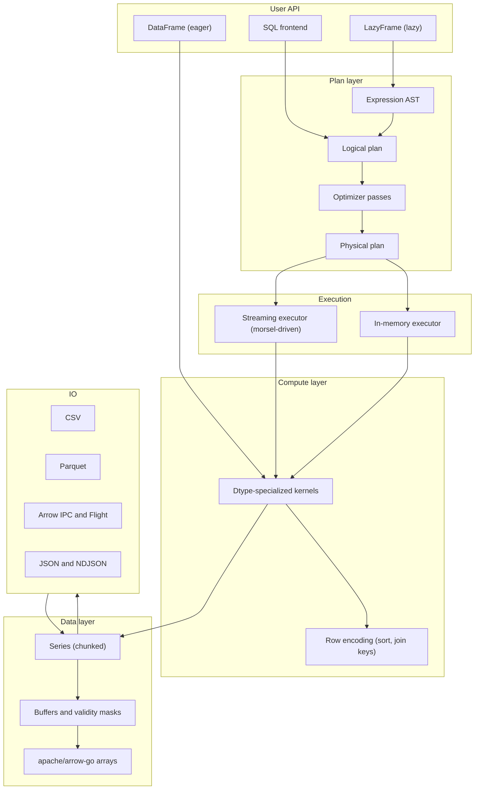
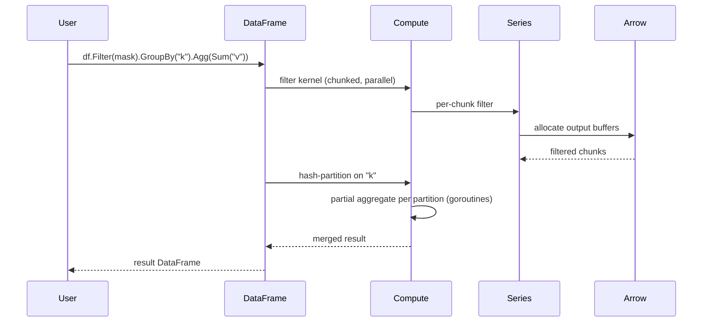
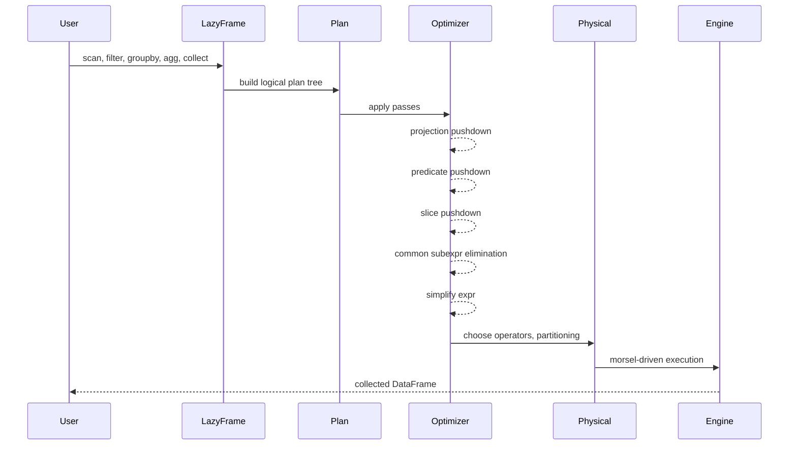

# Architecture overview

golars is a layered query engine over Apache Arrow memory. The user writes code against the `DataFrame` (eager) or `LazyFrame` (lazy) facades. Lazy code flows through an expression AST, a logical plan, an optimizer, and a physical plan before reaching the executor. Both eager and lazy paths converge on the same compute kernels and Series primitives.

## Layered component map

## Boundary between golars and arrow-go

golars uses `apache/arrow-go/v18` as its memory and IO substrate. The line is:

**arrow-go owns:**
- Array implementations (`arrow.Array`, all typed arrays)
- Memory allocation, buffers, reference counts (`memory.Allocator`, `memory.Buffer`)
- Arrow IPC reader and writer
- Parquet reader and writer
- CSV reader (we wrap it)
- Schema primitives at the physical level (`arrow.Schema`, `arrow.Field`)

**golars owns:**
- A logical dtype model on top of arrow dtypes, carrying polars semantics (for example logical dates, categoricals, enums, and the `Null` dtype)
- `Series` as a named, chunked, nullable column with dtype-aware methods
- `DataFrame` composition and transformation operations
- Expression AST, logical and physical plan, optimizer
- Streaming executor
- Group-by, join, sort, and pivot algorithms
- SQL frontend

When a polars feature exists in arrow-go with the right semantics, we wrap rather than reimplement. When polars' semantics differ from arrow's (null handling edge cases, dtype promotion, string comparisons), we implement in golars and document the choice.

## Data flow in an eager pipeline

## Data flow in a lazy pipeline

The streaming executor reads morsels (record batches of bounded row count) from sources, pipes them through operator goroutines over buffered channels, and terminates at a sink. Each operator stage scales horizontally with `GOMAXPROCS`.

## Conformance strategy

We use py-polars as the behavioral oracle during development. The `internal/testutil` package holds helpers that:

- Generate fixture DataFrames from JSON or parquet files under `testdata/`.
- Compare golars output to a golden file produced by a py-polars script committed alongside the fixture.
- Fail with a human-readable diff on drift.

This keeps us honest about semantics without pulling Python into CI. Python is only needed when regenerating golden files.
