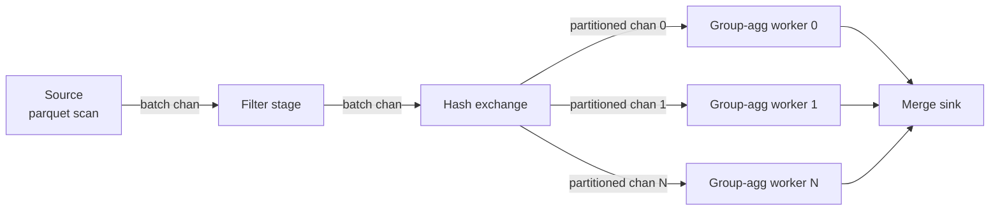

# Parallelism model

Go's concurrency primitives fit analytical query execution well. Goroutines are cheap, channels provide back-pressure for free, and `select` handles cancellation cleanly. This document describes how golars uses them.

## Two kinds of parallelism

golars distinguishes two parallelism patterns:

1. **Data parallelism inside a single operator.** A filter over a column with 64 chunks can run all chunks in parallel. The result preserves chunk order. This is what the eager executor uses for every kernel.

2. **Pipeline parallelism across operators.** A groupby-agg over a parquet file runs the scan, the hash partition, the partial aggregate, and the final merge as separate stages, each in its own goroutine, communicating via channels. This is what the streaming executor uses.

Both patterns compose. A single stage in the streaming executor may itself run data-parallel kernels internally.

## Worker pool

A single process-wide worker pool (default size `GOMAXPROCS`, overridable) dispatches chunk-level work for the eager executor. Benefits over spawning goroutines ad hoc:

- Predictable concurrency. We cap simultaneous work, which keeps memory bounded.
- Cheap cancellation. Closing the pool's context stops all in-flight chunks without leaking goroutines.
- Natural place to plug instrumentation (rows processed, time per chunk).

The pool lives in `internal/pool`. Its public type is `*Pool` with methods `Submit(ctx, func(ctx) error)` and `Wait()`. Internally it uses a bounded `chan func()` fed by a fixed set of worker goroutines.

We do not use `sync.WaitGroup` directly in user-facing code. `errgroup.Group` from `golang.org/x/sync/errgroup` handles error propagation and cancellation in the usual Go idiom.

## Morsel-driven streaming

The streaming executor borrows the morsel-driven model from HyPer and DuckDB and adapts it to Go. The implementation lives in the `stream` package; `lazy.WithStreaming()` compiles streaming-friendly plan prefixes into a `stream.Pipeline`.

Primitives currently available:

- `Source`, `Stage`, `Sink` as plain function types.
- `DataFrameSource` slices an in-memory frame into morsels. A row-partitioned parallel source is the next delivery.
- `FilterStage`, `ProjectStage`, `WithColumnsStage`, `RenameStage`, `DropStage`, `SliceStage` (state-carrying, tracks the running row counter across morsels).
- `ParallelMapStage` is the combinator that turns a per-morsel function into an order-preserving fan-out. It tags morsels on ingress with a sequence number, dispatches to a small worker pool, and uses a reorder buffer on egress so downstream stages see input order regardless of worker count. `ParallelFilterStage`, `ParallelProjectStage`, `ParallelWithColumnsStage` are thin wrappers.
- `CollectSink` concatenates morsel chunks column-wise into a single DataFrame.

Hybrid execution: `lazy.Collect(ctx, lazy.WithStreaming())` runs the longest streaming-friendly prefix through the pipeline executor. When a blocker node (Sort, Aggregate, Join) appears above that prefix, the upstream DataFrame is materialized first and the blocker runs eagerly. This keeps the surface simple (one `Collect` call) while letting streaming pay off for scan + filter + project chains and not regress for blockers.

**Morsel.** A morsel is an `arrow.Record` with a bounded number of rows (default 64K, tuned by workload). All inter-stage communication is in morsels.

**Channel back-pressure.** Every inter-stage channel has a small buffer (default 4). When a downstream stage is slow, its input channel fills, blocking the producer. This is the back-pressure mechanism, and it costs no allocation.

**Exchange.** Partition-parallel operators (hash groupby, hash join) insert a hash exchange: a stage that takes one input channel and fans out to N output channels, one per partition, by hashing the keys. Downstream workers own their partition end-to-end.

**Pipeline breakers.** Sort and groupby-agg with no suitable partition key are pipeline breakers. They buffer, compute, and then emit. The streaming executor tracks breakers explicitly so planners can decide when spilling is necessary.

**Cancellation.** Every stage takes a `context.Context`. When the context cancels (user abort, downstream error, sink closed), stages drain their input channels, release references to any morsels they hold, and return.

## Why goroutines over thread pools

polars uses Rayon, which is ideal for CPU-bound data-parallel loops in Rust. Go's goroutine scheduler does the same job for our workloads with less ceremony:

- Goroutines are cheap enough that we do not need a join-on-completion primitive. We just launch them.
- Channels are zero-allocation queues (for values up to channel element size). We do not reinvent bounded queues.
- `select` handles timeouts, cancellation, and multi-source reads in one construct. No event loop needed.

The tradeoff is that Go does not give us work-stealing the way Rayon does. In practice this matters less than it seems because our work units (morsels) are large enough that simple FIFO dispatch from the pool's channel is rarely the bottleneck. If profiling proves otherwise, we introduce work-stealing at the pool level without changing the operator interface.

## Determinism

Parallel execution must not change results. Rules:

- Chunked operations preserve chunk order in the output. A parallel filter produces chunks in the same order as input, even if they finished out of order.
- Aggregation results are deterministic modulo the associativity of the aggregation. Sum, min, max, count are exact. Mean, std, var use a numerically stable parallel algorithm (Welford-Chan) and are reproducible.
- Sort is stable.
- Row order in a DataFrame is preserved across operations unless an operation explicitly reorders (sort, join, groupby).

Tests cover determinism explicitly: the same input run N times produces byte-identical output.

## Scheduling heuristics

The planner picks chunk size and partition count based on:

- Estimated row count of the input
- Number of group-by keys (for partition count)
- `GOMAXPROCS`

If estimates are unavailable (lazy input from a scan with no statistics), we default to a morsel size of 64K rows and a partition count of `2 * GOMAXPROCS`. These defaults are tunable per-session.

## Profiling and observability

Every operator records rows in, rows out, bytes processed, and wall time. These metrics are available via `df.Profile()` on eager calls and `lf.Profile()` on lazy calls. Under the hood, the pool exposes `expvar` counters so long-running programs can scrape them.
