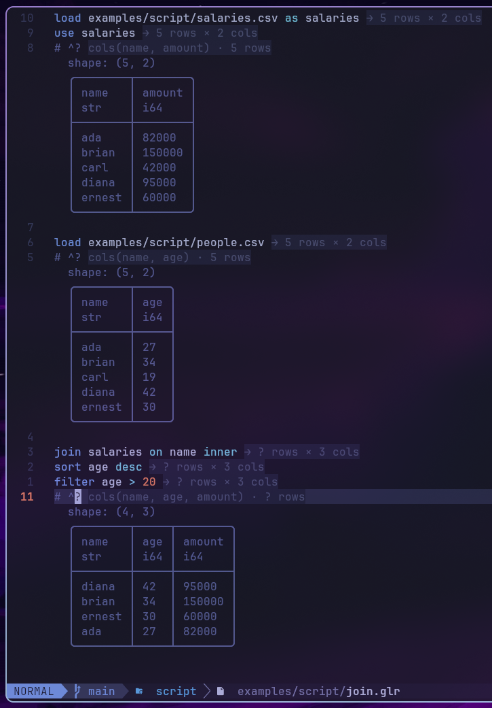

# golars scripting language (`.glr`)

`.glr` files are a tiny, line-oriented language for pipeline-style
DataFrame work. Designed to feel like "your REPL session in a file",
nothing more. Every REPL command you know is also a script statement.

```glr
# trades-daily.glr
load data/trades.csv          as trades
load data/symbols.csv         as symbols

use trades
filter volume > 100
groupby symbol amount:sum:total
join symbols on symbol
sort total desc
limit 10
show
```

Run it:

```sh
golars run trades-daily.glr       # one-shot
```

From inside the REPL:

```
golars » .source trades-daily.glr
```

---

## Grammar

```ebnf
program      = { statement NL } ;
statement    = empty
             | comment
             | command ;
comment      = "#" { any-char-until-NL } ;
command      = [ "." ] identifier { arg } ;
arg          = identifier | number | string | operator | "as" | "on" ;
string       = '"' { any-char } '"' ;
identifier   = ( letter | "_" ) { letter | digit | "_" | "." | "-" | "/" | ":" } ;
number       = [ "-" ] digit { digit } [ "." digit { digit } ] ;
operator     = "==" | "!=" | "<=" | ">=" | "<" | ">" | "and" | "or" ;
```

Statements are line-terminated. A trailing `\` (after any trailing
whitespace) continues onto the next physical line, useful for long
filter predicates:

```glr
filter salary > 100000 \
  and dept == "eng" \
  and tenure_years >= 2
```

The leading `.` on every command is optional: `load foo.csv` and
`.load foo.csv` do the same thing. A `#` inside a `"..."` string is
treated as a literal - only unquoted `#` starts a comment.

If you mis-spell a command golars tries to be helpful:

```
$ golars run typo.glr
typo.glr:3: unknown script command .filtet (did you mean `.filter`?)
```

---

## Statement reference

| Statement | What it does |
|-----------|--------------|
| `load PATH`                            | Focus a new frame (csv/tsv/parquet/ipc/arrow). |
| `load PATH as NAME`                    | Stage a frame under `NAME` without touching focus. |
| `use NAME`                             | Switch focus to a clone of `NAME`. `NAME` stays staged so repeated `use` branches off the same base; prior focus is discarded. |
| `stash NAME`                           | Materialize the focus and save it under `NAME`; focus continues with the snapshot. |
| `frames`                               | List loaded frames. The focused one is marked `*`. |
| `drop_frame NAME`                      | Release `NAME` from the registry. |
| `save PATH`                            | Materialize the focused pipeline and write to disk. |
| `select COL [, COL...]`                | Project columns (lazy). |
| `drop COL [, COL...]`                  | Drop columns (lazy). |
| `filter PRED`                          | Add a filter predicate (lazy). See [predicate grammar](#predicate-grammar). |
| `sort COL [asc\|desc]`                 | Sort by one column (lazy). |
| `limit N`                              | Keep the first N rows (lazy). |
| `head [N]`                             | Collect and print first N rows (default 10). |
| `tail [N]`                             | Collect and print last N rows. |
| `show`                                 | Alias for `head 10`. |
| `ishow` / `browse`                     | Open the focused pipeline in the interactive browse TUI on the alt screen. Quit with `q` to return to the REPL. |
| `schema`                               | Print column names + dtypes. |
| `describe`                             | count/null_count/mean/std/min/25%/50%/75%/max per column. |
| `groupby KEYS AGG [AGG...]`            | Group + aggregate. KEYS is comma-separated. AGG is `col:op[:alias]`; op is `sum`/`mean`/`min`/`max`/`count`/`null_count`/`first`/`last`. |
| `join PATH\|NAME on KEY [TYPE]`        | Join the focus with a file or named frame. TYPE ∈ `inner`/`left`/`cross` (default inner). |
| `explain`                              | Print logical plan, optimiser trace, optimised plan. |
| `explain_tree` / `tree`                | Same three-section report rendered as a box-drawn tree. |
| `graph` / `show_graph`                 | Styled plan tree with lipgloss colour coding. |
| `mermaid`                              | Emit the plan as a Mermaid flowchart. Pipe into `mmdc` for PNG/SVG. |
| `collect`                              | Materialize the pipeline back into the focused frame's source. |
| `reset`                                | Discard the lazy pipeline; keep the source. |
| `source PATH`                          | Run another `.glr` file inline. |
| `reverse`                              | Reverse row order of the focus. |
| `sample N [seed]`                      | Uniform-random sample of N rows without replacement. |
| `shuffle [seed]`                       | Randomly reorder every row. |
| `unique`                               | Drop duplicate rows across every column. |
| `null_count`                           | Per-column null count as a 1-row frame. |
| `glimpse [N]`                          | Compact peek at the first N rows (default 5). |
| `size`                                 | Estimated Arrow byte size of the pipeline result. |
| `timing`                               | Toggle per-statement timing. |
| `info`                                 | Runtime info: Go version, heap, uptime, row counts. |
| `clear`                                | Clear the screen. |
| `exit` / `quit`                        | Quit the REPL (no-op in `golars run` mode). |
| `cast COL TYPE`                        | Cast COL to `i64`/`i32`/`f64`/`f32`/`bool`/`str`. |
| `fill_null VALUE`                      | Replace nulls across compatible columns with VALUE. |
| `drop_null [COL...]`                   | Drop rows with nulls in any (or the listed) columns. |
| `rename OLD as NEW`                    | Rename one column. |
| `sum COL` / `mean COL` / `min COL` / `max COL` / `median COL` / `std COL` | Print one scalar for COL. |
| `write PATH`                           | Alias for `save`. Supported sinks: `.csv`, `.tsv`, `.parquet`, `.arrow`, `.ipc`, `.json`, `.ndjson`/`.jsonl`. |
| `with_row_index NAME [OFFSET]`         | Prepend an int64 row index. |
| `sum_horizontal OUT [COL...]`          | Append a row-wise sum column (nulls ignored). |
| `mean_horizontal OUT [COL...]`         | Append a row-wise mean column. |
| `min_horizontal OUT [COL...]`          | Row-wise min. |
| `max_horizontal OUT [COL...]`          | Row-wise max. |
| `all_horizontal OUT [COL...]`          | Row-wise boolean AND. |
| `any_horizontal OUT [COL...]`          | Row-wise boolean OR. |
| `sum_all` / `mean_all` / `min_all` / `max_all` / `std_all` / `var_all` / `median_all` | One-row per-column aggregate over every numeric column. |
| `count_all` / `null_count_all`         | One-row per-column (null-)count. |
| `scan_csv PATH [as NAME]`              | Register a lazy CSV scan (push-down friendly). |
| `scan_parquet PATH [as NAME]`          | Lazy Parquet scan. |
| `scan_ipc PATH [as NAME]`              | Lazy Arrow IPC scan. |
| `scan_json PATH [as NAME]`             | Lazy JSON scan. |
| `scan_ndjson PATH [as NAME]`           | Lazy NDJSON scan. |
| `scan_auto PATH [as NAME]`             | Infer the scan format from the file extension. |
| `fill_nan VALUE`                       | Replace NaN with VALUE in every float column. |
| `forward_fill [LIMIT]`                 | Forward-fill nulls per column (LIMIT=0 is unlimited). Leading nulls stay null. |
| `backward_fill [LIMIT]`                | Backward-fill nulls per column. Trailing nulls stay null. |
| `top_k K COL`                          | Keep K rows with the largest values in COL. |
| `bottom_k K COL`                       | Keep K rows with the smallest values in COL. |
| `transpose [HEADER_COL] [PREFIX]`      | Transpose the focus (numeric/bool columns). |
| `unpivot IDS [VALS]`                   | Wide-to-long reshape. IDS/VALS are comma-separated lists. |
| `partition_by KEYS`                    | Print a summary of per-key-combination row counts. |
| `skew COL` / `kurtosis COL`            | Scalar skewness / excess kurtosis. |
| `approx_n_unique COL`                  | HyperLogLog estimate of distinct-value count. |
| `corr COL1 COL2` / `cov COL1 COL2`     | Pair-wise Pearson corr / sample cov. |
| `pivot INDEX ON VALUES [AGG]`          | Long-to-wide pivot. AGG: first/sum/mean/min/max/count. |
| `pwd` / `ls [PATH]` / `cd [PATH]`      | Working-directory helpers. |
| `unnest COL`                           | Project fields of a struct-typed column as top-level columns. |
| `explode COL`                          | Fan out each element of a list-typed column into its own row. |
| `upsample COL EVERY`                   | Interpolate a sorted timestamp column at `ns`/`us`/`ms`/`s`/`m`/`h`/`d`/`w` intervals. |

### String operations

String-column ops are reachable via `col(x).str.<op>()` on the expression
API, and inside `.filter` via keyword operators that desugar to the same
Exprs. Every op below is backed by the series kernel of the same name; the
expression layer is a thin dispatch on the function name.

| Filter keyword | Expr method | Notes |
|----------------|-------------|-------|
| `contains "sub"` | `col(x).str.contains("sub")` | Literal substring, no regex |
| `starts_with "p"` | `col(x).str.starts_with("p")` | Byte-prefix |
| `ends_with "s"` | `col(x).str.ends_with("s")` | Byte-suffix |
| `like "%pat%"` | `col(x).str.like("%pat%")` | SQL wildcards: `%` any, `_` one, `\\` escape |
| `not_like "%pat%"` | `col(x).str.not_like("%pat%")` | Negation fused into the kernel |

Non-predicate string ops available on Expr (no filter-grammar sugar, used
via `.select`, `.with_column`, or in aggregations):

`str.to_lower`, `str.to_upper`, `str.trim`, `str.strip_prefix(p)`,
`str.strip_suffix(s)`, `str.replace(o, n)`, `str.replace_all(o, n)`,
`str.len_bytes`, `str.len_chars`, `str.count_matches(s)`, `str.find(s)`,
`str.head(n)`, `str.tail(n)`, `str.slice(start, length)`,
`str.contains_regex(pat)`.

### Predicate grammar

For `filter`:

```
col op value [and|or col op value]...
```

- No parentheses, left-to-right evaluation.
- Ops: `==`, `!=`, `<`, `<=`, `>`, `>=`, `is_null`, `is_not_null`.
- Values: integers, floats, double-quoted strings, `true`, `false`.

Examples:

```glr
filter age >= 21 and salary > 50000
filter symbol == "AAPL"
filter is_active and created_at > 1704067200000000
filter note is_null
```

---

## Multi-source workflows

Scripts regularly need N frames. The `as NAME` / `use NAME` /
`.frames` trio is the whole story: there's no hidden namespace:

```glr
# Stage every input up front. None of these promote themselves to
# focus, so we can read them in any order.
load data/trades.csv    as trades
load data/symbols.csv   as symbols
load data/users.csv     as users

# Work on one, stash it, work on the next.
use trades
filter volume > 100
groupby user_id amount:sum:total_bought
stash trade_totals

# `use` is non-consuming: trade_totals stays staged, and so does the
# original trades frame: we could `use trades` again to branch off a
# different filter.
use users
filter region == "US"
join trade_totals on user_id
join symbols on symbol
sort total_bought desc
show
```

`stash` is the "save into a variable" move: it materializes whatever
lazy pipeline is on the focus and parks a copy under `NAME` so later
`use NAME` gives you that snapshot. The focus itself keeps going
from the snapshot, so the idiomatic branching pattern is:

```glr
load data/trades.csv
filter volume > 100
stash base

filter side == "buy"
stash buys

use base
filter side == "sell"
stash sells

use buys
join sells on symbol
```

When `.join` sees a name that exists in the frame registry, it
consumes that frame (keeping it in the registry for reuse) instead
of treating the argument as a path. Paths win only when no frame
matches.

### Anonymous `load PATH`

The short form `load PATH` (no `as`) is equivalent to `use NAME`
where `NAME` is empty. It's the "single-frame script" ergonomic:

```glr
load data/trades.csv
filter volume > 100
show
```

No registry, no juggling: just pipe.

---

## Interop with code

Anything that implements `script.Executor` can host the language.
`cmd/golars` is the reference, but the package ships a generic
runner:

```go
import "github.com/Gaurav-Gosain/golars/script"

r := script.Runner{
    Exec:  script.ExecutorFunc(func(line string) error { /* … */ return nil }),
    Trace: func(line string) { fmt.Println(">", line) },
    ContinueOnErr: true,
    ErrOut: os.Stderr,
}
if err := r.RunFile("pipeline.glr"); err != nil {
    log.Fatal(err)
}
```

- `Trace` receives every normalised statement just before execution.
- `ContinueOnErr` + `ErrOut` emits errors inline and keeps running.
- `script.Normalize(raw)` is exported so third parties can apply the
  same parsing rules (comment stripping, leading `.` insertion).

---

## Editor support

Tree-sitter grammar + highlight queries live at
[`editors/tree-sitter-golars/`](../editors/tree-sitter-golars/).
Install notes for Neovim (`nvim-treesitter`) and VS Code in that
directory's README.

### LSP

<p align="center"></p>

[`cmd/golars-lsp`](../cmd/golars-lsp/) is a minimal Language Server
that ships:

- **Inline completions** for commands, staged-frame names, file
  paths, and column names read from loaded CSV files.
- **Inlay hints** showing each pipeline step's output shape -
  `→ 5 rows × 3 cols` appears at the end of every shape-changing
  statement. Row counts propagate as upper bounds: `limit N` clamps
  to `N`, left joins preserve the left side's count, filters and
  inner joins mark rows `?`.
- **Hover docs** with signature + long description on any command
  token.
- **Diagnostics** for unknown commands and files that don't resolve.

### `# ^?` probe: live table previews

Drop `# ^?` on its own line anywhere in a script and the Neovim
plugin renders the focused frame's current table as virtual text
below the comment (via a `golars --preview` subprocess). This is the
scripting equivalent of Twoslash/Quokka probes: a live peek at the
data at that pipeline position:

```glr
load data/trades.csv
filter volume > 100
sort amount desc
limit 5
# ^?
```

The preview updates on save + debounced text changes; configure via
`require("golars").setup({ preview_cmd = { "/path/to/golars" },
preview_rows = 20, preview_timeout_ms = 3000 })`. Set `preview = false`
to disable.

### `golars --preview <path>`

Invoke the preview pipeline from any editor, or manually via:

```sh
golars --preview path/to/script.glr
golars --preview path/to/script.glr --preview-rows 25
```

Runs the script silently (no banner, no trace, no success chrome)
and prints exactly one rendered table: the focused pipeline's head.
Exit code 0 on success, non-zero on script error (message on stderr).

---

## What this language is NOT

- No variables beyond the named-frame registry. If you need
  branching or reusable expressions, write a Go program that
  drives `script.Runner` with your own logic.
- No control flow (no `if`, no loops). The idiom for conditional
  runs is shell scripting around `golars run`, or a Go host with
  an `Executor` that dispatches.
- No expression language beyond the filter predicate DSL and
  groupby agg spec. Polars-style `pl.col("a") + pl.col("b")` is a
  `cmd/golars` feature we might add later, but the base language
  stays small.

The design target is "drop a day of REPL work into a file and have
it run again tomorrow." Everything else is out of scope.
